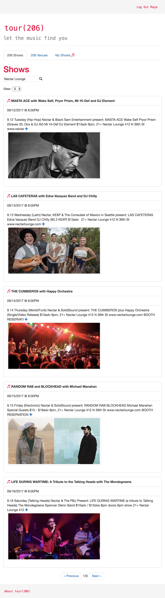
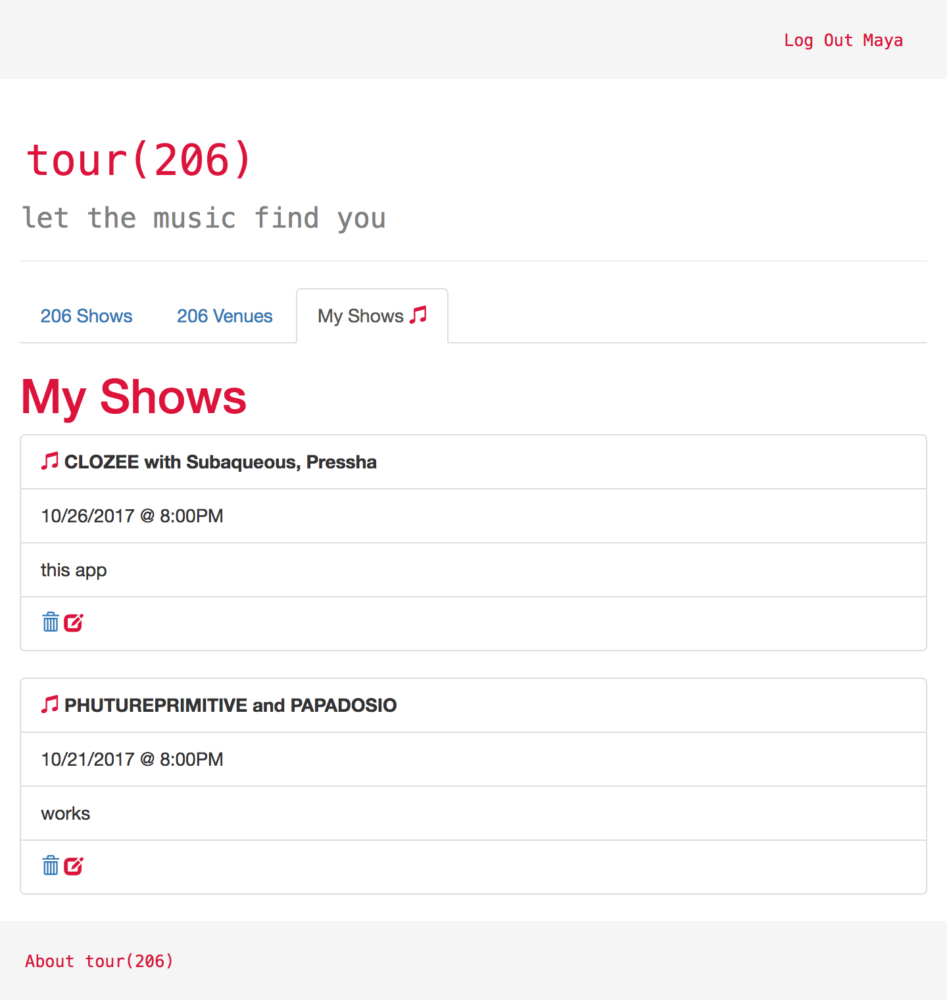

# Tour(206)
##### A Ruby on Rails / Angular App

Tour(206) is an easy way to find concerts happening in Seattle. Discover all the information you need to experience the best live music and venues in the city.

---

### MVP

* Rails server with full CRUD operations and a JSON API
* Angular front end app
* CORS configuration
* One-to-many relationship between user and favorite shows
* Trello

---

### Extra Features

* Third party API (Eventbrite) using httparty gem
* JavaScript Web Token authentication
* CSS Framework (Bootstrap)

---

### Technologies

* JavaScript
* Angular
* Ruby on Rails
* CSS Bootstrap
* JWT
* Heroku

---

### User Stories

1. User can view concerts happening in Seattle by date (calendar list view).
3. User can add/delete concerts to/from a list of favorites (attending).
4. User can access data about the concert and search concerts using a keyword (artist name, genre of music, etc).
5. User views content accessed directly through a 3rd party API (Eventbrite) that updates in real time.
6. User can navigate between different nav tab views (shows, venues, favorited shows) without the page reloading.
7. User's data saves and can be accessed every time user logs in. 

---

### Process

1. Wireframes
1. Trello board: https://trello.com/b/2uQkYc1t/tour206
1. Initial page styling and layout
1. Eventbrite API Call
1. Full CRUD

---

### 

1. Pagination lets you scroll thru negative pages... wtf...
1. Expand/collapse doesn't have a toggle yet.
1. We have yet to add Venues. Definitely want to do that.
1. Also want to continue pulling from multiple third party APIs to get data from all the area ticket providers, not just Eventbrite.
1. Should add an image URL to the My Shows page.
